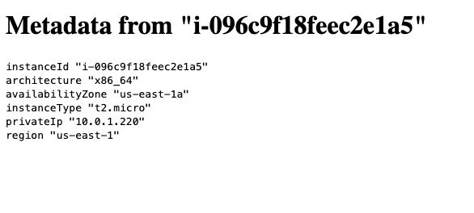

# Terraform Ansible Setup

### Prerequisites
Docker
On `.aws/credentials` create a new profile
```
[default]
aws_access_key_id=YOUR_ACCESS_KEY_ID
aws_secret_access_key=YOUR_SECRET_ACCESS_KEY
```


### Installing

```
make build
make setup
make init environment=develop
```

## Deployment

```sh
make plan environment=develop
```


## How to apply changes

```sh
make apply environment=develop
```
## Custom terraform changes
```sh
make container
terraform plan -target=module.nat
```

### How to SSH into instances
```sh
ssh -i "./environments/develop/files/ssh_keys/develop" -A ec2-user@x.x.x.x
ssh ubuntu@y.y.y.y
```

### Result


### Destroy
```sh
make destroy environment=develop
```

### Reuse project
```sh
git clone https://github.com/AxelMonroyX/terraform-structure.git
cd terraform-structure
rm -rf .git
git init
git config user.name "Your Name"
git config user.email "youremail@email.com"
git add .
git commit -m "Initialize project"
git remote add origin yourOrigin/terraform-structure.git
```
## Built With

* [Terraform](https://www.terraform.io/) - The web framework used
* [terraform-docs](https://github.com/segmentio/terraform-docs/) - Terraform documentation generator
* [nginx](https://www.nginx.com/) - Nginx is a web server


## Authors

* **Axel Monroy** - [Github](https://github.com/AxelMonroyX)


